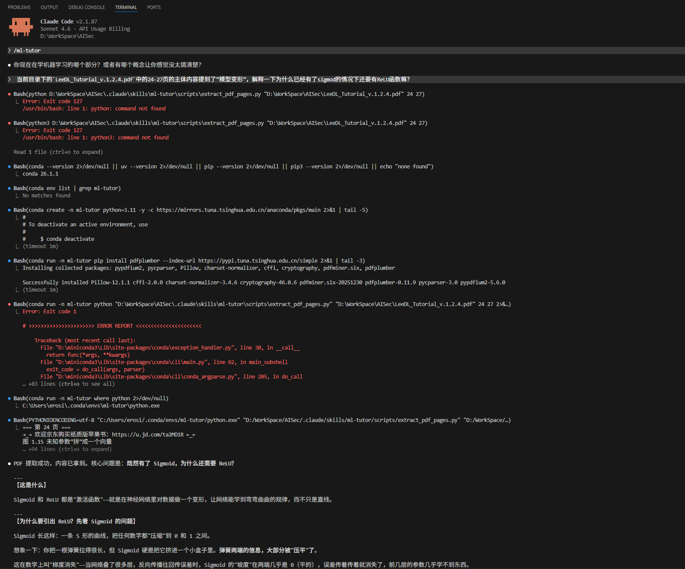

# AISec — 从机器学习到AI安全

> 📥 **配套教材下载**：[LeeDL Tutorial（李宏毅深度学习教程）](https://github.com/datawhalechina/leedl-tutorial/releases)

> "在机器学习中，你只需要感受数学的工程魅力~"
$$L(\theta) \approx L(\theta') + L'(\theta') \cdot (\theta - \theta') + \frac{1}{2} \cdot L''(\theta') \cdot (\theta - \theta')^2$$
## 启用机器学习助教

本项目内置了一个关于机器学习的SKILL助教，把你不会的知识丢给它，它将带你轻松学习数学难题~

如何使用助教：

```bash
git clone https://github.com/Erosion2020/AISec.git

cd AISec

# claude启动时默认加载当前WorkSpace的.claude/skills
claude

# 启用助教
>/ml-tutor
```

直接告诉助教你正在学习的内容 或 告诉它对应的pdf页码，如果你是第一次运行~ 它会尝试自己解决关于python环境的问题，这个过程完成后会尝试翻阅pdf中的内容，就像这样：




## 深度学习笔记

> 内容来源：李宏毅 2021 深度学习课程（LeeDL Tutorial），加上我自己的理解和重新整理。
> 每一章我会用自己的话写一遍，不会照搬公式，重点是让你看完之后知道"这东西在干什么"。

### 基础篇 - 线性模型

- [ ] 第 1 章：最简单的线性模型 `wx+b`
- [ ] 第 2 章：损失函数 `Loss(wx+b)`与衡量标准
- [ ] 第 3 章：梯度下降 - 依据`Loss`的优化
- [ ] 第 4 章：分段线性曲线与两种激活函数 `sigmod、ReLU`
- [ ] 第 6 章：反向传播 — 模型怎么知道该改哪里

### 神经网络篇

- [ ] 第 6 章：神经网络结构 — 从线性到多层
- [ ] 第 7 章：激活函数 — Sigmoid / ReLU 在干什么
- [ ] 第 8 章：过拟合与泛化 — 为什么训练好的模型可能是废的
- [ ] 第 9 章：正则化与 Dropout — 怎么让模型不那么死记硬背
- [ ] 第 10 章：批归一化（Batch Normalization） — 为什么要标准化

### 进阶篇

- [ ] 第 11 章：卷积神经网络（CNN） — 图像识别怎么做
- [ ] 第 12 章：循环神经网络（RNN / LSTM） — 处理序列数据
- [ ] 第 13 章：自注意力机制（Self-Attention） — Transformer 的核心
- [ ] 第 14 章：Transformer 架构 — 现代大模型的基础

### 生成模型篇

- [ ] 第 15 章：GAN — 让模型学会"创造"
- [ ] 第 16 章：扩散模型（Diffusion Model） — Stable Diffusion 的原理

---

## AI 安全应用

> 这是这个仓库的终点站。学会了深度学习之后，怎么把它用在安全研究上。

- [ ] 异常检测 — 用 AI 发现"不正常的流量"
- [ ] 漏洞模式识别 — 训练模型找代码中的漏洞特征
- [ ] 恶意流量分类 — 把网络流量分成"正常/攻击"
- [ ] 对抗样本（Adversarial Examples） — 怎么骗过 AI 模型，以及怎么防御
- [ ] 大模型安全 — Prompt Injection、越狱攻击的原理

---

## 数学概念索引

> 这里专门解释公式。每一个条目都包含：
> - 这个符号/公式在说什么（大白话）
> - 一个具体的数字例子，手算一遍
> - 它在机器学习里用在哪里
>
> **目标：初中数学基础的人看完之后能说出"哦，原来是这个意思"。**

### 基础数学

- [x] [微分与偏导数](math/calculus-diff-and-partial-derivatives.md) — 从斜率逼近到偏导数，以及它们如何驱动梯度下降
- [x] [向量与矩阵](math/calculus-diff-and-partial-derivatives.md)
- [ ] 梯度 — 多维空间里的"最陡方向"
- [ ] 链式法则 — 函数套函数时怎么求导（反向传播的数学基础）


## 进度

- 开始时间：2026 年 3 月 28日
- 当前状态：基础篇进行中
- 预计完成深度学习基础篇：待定

*这个仓库会持续更新。如果你觉得某个地方解释得不够清楚，欢迎提交 Issue。*

## 致谢

**李宏毅老师** — 台湾大学教授，他的深度学习课程是这个仓库的主要内容来源。课程讲得深入浅出，是目前中文世界里最好的深度学习公开课之一。

- YouTube 频道：[@HungyiLeeNTU](https://www.youtube.com/@HungyiLeeNTU)
- 本仓库使用的课程：[Machine Learning 2021](https://www.youtube.com/playlist?list=PLJV_el3uVTsMhtt7_Y6sgTHGHp1Vb2P2J)

**datawhalechina / leedl-tutorial** — 本仓库使用的 PDF 教材来源于该开源项目，他们将李宏毅课程整理成了结构化的教程文档。

- GitHub：[datawhalechina/leedl-tutorial](https://github.com/datawhalechina/leedl-tutorial)

---

## 参考

- [kamranahmedse/developer-roadmap](https://github.com/kamranahmedse/developer-roadmap) — 学习路线图
